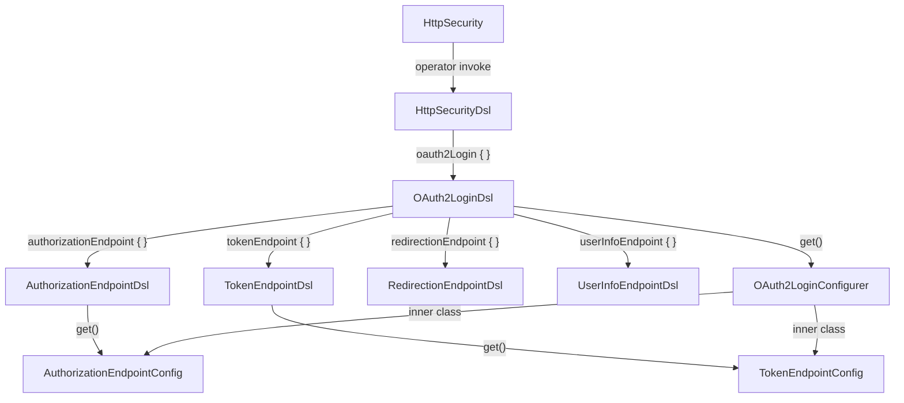

# Kotlin DSL Standard Implementation Plan

## Cross-Analysis: Kotlin DSL vs Java DSL

### Java DSL (`OAuth2LoginConfigurer`) Characteristics

- **Method chaining** fluent builder returning `this` (e.g., `configurer.loginPage(url).permitAll()`)
- **Inner classes** for sub-feature config (e.g., `AuthorizationEndpointConfig`, `TokenEndpointConfig`)
- **Explicit assertions** guard every setter (`Assert.notNull(...)`, `Assert.hasText(...)`)
- **`Customizer<T>` SAM** interfaces as customization hooks
- Sub-feature config accessed via: `configurer.authorizationEndpoint(customizer -> customizer.baseUri(...))`

### Kotlin DSL (`OAuth2LoginDsl`) Characteristics

- **Property-based assignment** (no chaining): `loginPage = "/custom"`
- **Lambda with receiver** for nested sub-features: `authorizationEndpoint { baseUri = "/auth" }`
- **Language-level null-safety** replaces explicit assertions
- **`internal fun get()`** returns a `(JavaConfigurer) -> Unit` that bridges to the Java API

---

## Design Patterns Identified

### Pattern 1: Operator Extension Entry Point

Defined once in [`HttpSecurityDsl.kt`](config/src/main/kotlin/org/springframework/security/config/annotation/web/HttpSecurityDsl.kt):

```kotlin
operator fun HttpSecurity.invoke(httpConfiguration: HttpSecurityDsl.() -> Unit) =
    HttpSecurityDsl(this, httpConfiguration).build()
```

Enables the `http { ... }` block syntax. Each feature DSL is invoked from `HttpSecurityDsl` following a single uniform method pattern:

```kotlin
fun oauth2Login(oauth2LoginConfiguration: OAuth2LoginDsl.() -> Unit) {
    val oauth2LoginCustomizer = OAuth2LoginDsl().apply(oauth2LoginConfiguration).get()
    this.http.oauth2Login(oauth2LoginCustomizer)
}
```

### Pattern 2: Adapter / Proxy Pattern

Each Kotlin DSL class is an adapter around its Java configurer. `OAuth2LoginDsl` wraps `OAuth2LoginConfigurer<HttpSecurity>`. The `internal fun get()` is the adapter's translation method — it captures all configured state and produces a Java `Customizer` lambda.

### Pattern 3: Lambda with Receiver (Core DSL Pattern)

Sub-features with their own Java inner config class get a dedicated sub-DSL invoked via lambda with receiver:

```kotlin
fun authorizationEndpoint(authorizationEndpointConfig: AuthorizationEndpointDsl.() -> Unit) {
    this.authorizationEndpoint = AuthorizationEndpointDsl().apply(authorizationEndpointConfig).get()
}
```

The result of `.get()` is a `(JavaInnerConfig) -> Unit` lambda, stored as a private `var` and applied later in the parent's `get()`.

### Pattern 4: Null-Safe Optional Application

All direct properties are declared `var property: Type? = null`. In `get()`, each is applied only when non-null using `?.also {}`, preserving Java defaults:

```kotlin
loginPage?.also { oauth2Login.loginPage(loginPage) }
```

### Pattern 5: `@DslMarker` Scope Restriction

Two-tier annotation hierarchy prevents outer receiver implicit access inside nested lambdas:

- Top-level DSLs (e.g., `OAuth2LoginDsl`) annotated `@SecurityMarker`
- Sub-feature DSLs (e.g., `AuthorizationEndpointDsl`) annotated with a domain-specific marker: `@OAuth2LoginSecurityMarker`

Both markers are `@DslMarker` annotations. Sub-DSL markers live alongside their DSL classes:

- [`SecurityMarker.kt`](config/src/main/kotlin/org/springframework/security/config/annotation/web/SecurityMarker.kt)
- [`OAuth2LoginSecurityMarker.kt`](config/src/main/kotlin/org/springframework/security/config/annotation/web/oauth2/login/OAuth2LoginSecurityMarker.kt)

### Pattern 6: Mutually Exclusive Properties (Backing Property Pattern)

When two properties are mutually exclusive (only one can be active), backing private fields with custom property setters that clear the other field are used (see [`JwtDsl.kt`](config/src/main/kotlin/org/springframework/security/config/annotation/web/oauth2/resourceserver/JwtDsl.kt) and [`OidcBackChannelLogoutDsl.kt`](config/src/main/kotlin/org/springframework/security/config/annotation/web/oauth2/login/OidcBackChannelLogoutDsl.kt)):

```kotlin
private var _jwtDecoder: JwtDecoder? = null
private var _jwkSetUri: String? = null
var jwtDecoder: JwtDecoder?
    get() = _jwtDecoder
    set(value) { _jwtDecoder = value; _jwkSetUri = null }
var jwkSetUri: String?
    get() = _jwkSetUri
    set(value) { _jwkSetUri = value; _jwtDecoder = null }
```

### Pattern 7: Multi-Param Method → Pair Storage

Java methods with logically paired parameters are stored as a `Pair` and exposed as a regular function:

```kotlin
private var defaultSuccessUrlOption: Pair<String, Boolean>? = null
fun defaultSuccessUrl(defaultSuccessUrl: String, alwaysUse: Boolean) {
    defaultSuccessUrlOption = Pair(defaultSuccessUrl, alwaysUse)
}
```

Applied in `get()`:

```kotlin
defaultSuccessUrlOption?.also {
    oauth2Login.defaultSuccessUrl(defaultSuccessUrlOption!!.first, defaultSuccessUrlOption!!.second)
}
```

### Pattern 8: Convenience No-Arg Function for Boolean Flags

Boolean flags that can only be set to `true` via a no-arg call expose both a `var` property and a no-arg `fun`:

```kotlin
var permitAll: Boolean? = null
fun permitAll() { permitAll = true }
```

### Pattern 9: Disable Flag Pattern

Java's `configurer.disable()` maps to a `private var disabled = false` backed by `fun disable()`, checked at build time:

```kotlin
private var disabled = false
fun disable() { disabled = true }
// In get():
if (disabled) { login.disable() }
```

---

## Architecture Diagram



---

## Standard Implementation Plan for a New Kotlin DSL

### Step 1: Identify Java Configurer and Map Its API

Given Java configurer `XxxConfigurer<HttpSecurity>`:

- Direct `method(value)` setters → `var property: Type? = null`
- Multi-param methods → `private var option: Pair<A,B>? = null` + `fun method(a,b)`
- Boolean enable-only flags → `var flag: Boolean? = null` + `fun flag()`
- `disable()` → `private var disabled = false` + `fun disable()`
- Inner config classes → separate sub-DSL (Step 3)
- Mutually exclusive properties → backing field pattern (Pattern 6)

### Step 2: Create DSL Marker Annotation (if new domain)

If this DSL introduces a new domain namespace (e.g., a new oauth2 feature area), create a domain-scoped marker in the sub-package. If it belongs to an existing domain (e.g., another oauth2 login sub-feature), reuse the existing marker.

File: `config/src/main/kotlin/.../XxxSecurityMarker.kt`

```kotlin
@DslMarker
annotation class XxxSecurityMarker
```

### Step 3: Create Sub-DSL Classes (one per Java inner config class)

For each `JavaConfigurer.SubConfig` inner class, create `XxxSubDsl.kt` in the domain sub-package:

- Annotated with domain-specific `@XxxSecurityMarker`
- `var` properties for each configurable option (nullable)
- Apply mutually exclusive backing property pattern where applicable
- `internal fun get(): (JavaConfigurer.SubConfig) -> Unit`

File: `config/src/main/kotlin/.../xxx/XxxSubDsl.kt`

```kotlin
@XxxSecurityMarker
class XxxSubDsl {
    var someOption: SomeType? = null

    internal fun get(): (JavaConfigurer.SubConfig) -> Unit {
        return { subConfig ->
            someOption?.also { subConfig.someOption(someOption) }
        }
    }
}
```

### Step 4: Create Main DSL Class

File: `config/src/main/kotlin/.../XxxDsl.kt`

```kotlin
@SecurityMarker
class XxxDsl {
    // Direct configuration properties
    var directOption: DirectType? = null

    // Multi-param storage
    private var pairOption: Pair<String, Boolean>? = null

    // Boolean flag
    var boolFlag: Boolean? = null

    // Disable flag
    private var disabled = false

    // Sub-DSL lambda storage (private, typed to Java inner config)
    private var subFeature: ((JavaConfigurer.SubConfig) -> Unit)? = null

    // Convenience no-arg for boolean flag
    fun boolFlag() { boolFlag = true }

    // Convenience for multi-param
    fun pairOption(a: String, b: Boolean) { pairOption = Pair(a, b) }

    // Disable
    fun disable() { disabled = true }

    // Sub-DSL entry point
    fun subFeature(subFeatureConfig: XxxSubDsl.() -> Unit) {
        this.subFeature = XxxSubDsl().apply(subFeatureConfig).get()
    }

    internal fun get(): (JavaConfigurer<HttpSecurity>) -> Unit {
        return { configurer ->
            directOption?.also { configurer.directOption(directOption) }
            pairOption?.also { configurer.pairOption(pairOption!!.first, pairOption!!.second) }
            boolFlag?.also { configurer.boolFlag(boolFlag!!) }
            subFeature?.also { configurer.subFeature(subFeature) }
            if (disabled) { configurer.disable() }
        }
    }
}
```

### Step 5: Register in HttpSecurityDsl

Add to [`HttpSecurityDsl.kt`](config/src/main/kotlin/org/springframework/security/config/annotation/web/HttpSecurityDsl.kt):

```kotlin
fun xxxFeature(xxxConfiguration: XxxDsl.() -> Unit) {
    val xxxCustomizer = XxxDsl().apply(xxxConfiguration).get()
    this.http.xxxFeature(xxxCustomizer)
}
```

### Step 6: File Layout Convention

```
config/src/main/kotlin/.../
├── XxxDsl.kt                         # main DSL class (@SecurityMarker)
└── xxx/
    ├── XxxSecurityMarker.kt          # @DslMarker annotation (if new domain)
    ├── XxxSubFeatureDsl.kt           # sub-DSL class (@XxxSecurityMarker)
    └── XxxOtherSubDsl.kt             # additional sub-DSL classes
```

### Step 7: Write Tests

Tests live in a parallel package under `config/src/test/kotlin/`:

- **Top-level DSL tests** (`XxxDslTests.kt`): one test per configurable property/sub-feature, following `@ExtendWith(SpringTestContextExtension::class)` with inner `@Configuration @EnableWebSecurity open class` configurations
- **Sub-DSL tests** (`XxxSubDslTests.kt` in `.../xxx/` sub-package): one test per sub-DSL option

Test naming convention: `` `xxx when [scenario] then [expected outcome]` ``

Test structure:

```kotlin
@ExtendWith(SpringTestContextExtension::class)
class XxxDslTests {
    @JvmField val spring = SpringTestContext(this)
    @Autowired lateinit var mockMvc: MockMvc

    @Test
    fun `xxx when custom option then option used`() {
        this.spring.register(CustomOptionConfig::class.java).autowire()
        // assert via mockMvc or mockkObject + verify
    }

    @Configuration
    @EnableWebSecurity
    open class CustomOptionConfig {
        @Bean
        open fun securityFilterChain(http: HttpSecurity): SecurityFilterChain {
            http {
                xxxFeature {
                    someOption = CUSTOM_VALUE
                }
            }
            return http.build()
        }
    }
}
```
